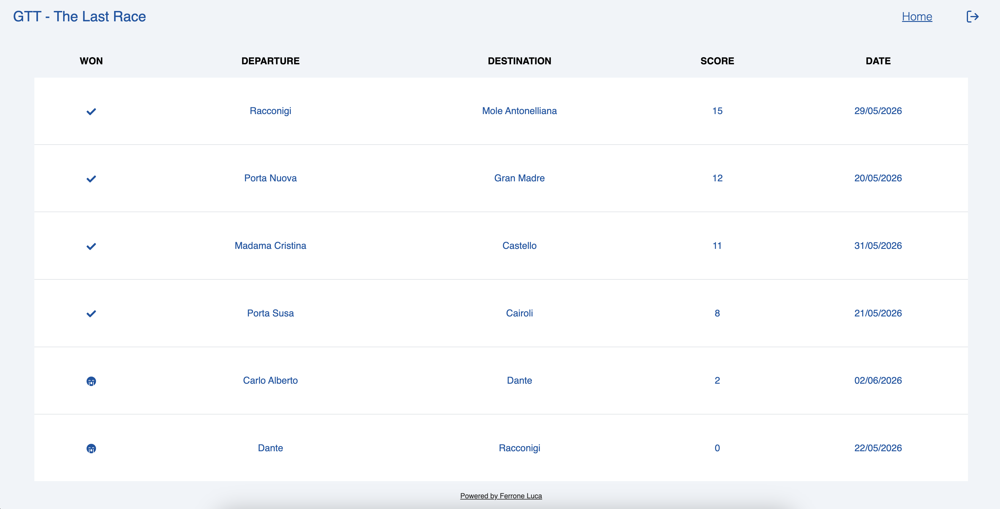
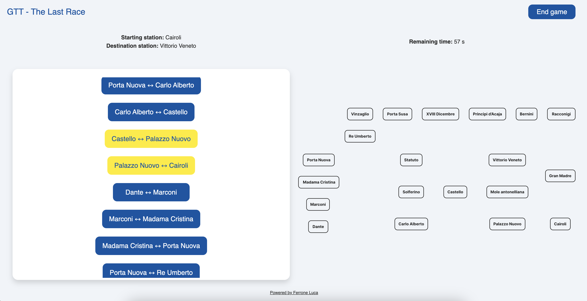
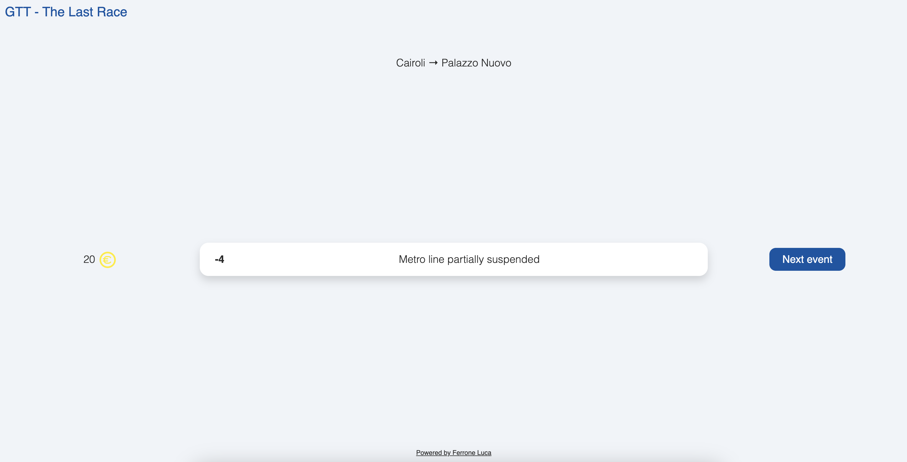

# Exam 1 (June 2026): "Last Race"

### Student: s358462 Ferrone Luca

## React Client Application Routes

| Public route | Description |
|:-------------|:------------|
|  `/`         | This route contains the home page, accessible to everyone         |
| `/sign-up`   | This route contains the registration form, accessible to everyone |
| `/login`     | This route contains the login form, accessible to everyone        |

| Protected route  | Description |
|:-----------------|:------------|
| `/logout`        | This route contains the logout alert             | 
| `/results`       | This route contains the game results of the user |
| `/game`.         | This route is composed of other private routes, and contains the game pages |

By protected routes I mean that the user must be logged in to access them.

## API Server

A detailed description can be found [here](./server/API_explanation.md).

## Database Tables

- Table `Users` - contains user_id, email, password_hash, salt

- Table `Stations` - contains station_id, name, is_interchange

- Table `Games` - contains game_id, user_id*, start_station_id*, destination_station_id*, score, won, played_at

- Table `Events` - contains event_id, description, score

- Table `Lines` - contains line_id, name

- Table `Connections` - contains connection_id, line_id* , station_u_id*, station_v_id*

## Main React Components

- `LastRaceApp` : contains all application routes

### Pages
- `HomePage` : contains the home page subcomponents
- `LoginPage` : contains the login page subcomponents
- `LogoutPage` : contains the logout page subcomponents
- `SignUpPage` : contains the registration form page
- `ResultsPage` : contains the table with all results of the user
- `StartGamePage` : contains the map without connections and the list of all connections of the network
- `ExecuteGamePage` : shows  events one after another
- `FinishedGamePage` : prints the final message
- `EndGamePage` : contains a module to end the game before the end of time

### Components
- `ResultTable` : shows the table containing user game results
- Three different variants of navbar
  - `NavbarWithLink`
  - `NavbarTitleOnly`
  - `NavbarWithButton`
- Two variant of network map
  - `Map` : shows the network map ( stations + connections )
  - `MapWithoutConnections` : shows the network map ( only stations without connections )
- `ListOfConnections` : shows a list of clickable buttons, used during the game
- `Footer` : shows a link connected to my LinkedIn account
- Five different cards
  - `EndGameCard` : contains the module to end a game
  - `EventCard` : contains the event shown in `ExecuteGamePage`
  - `LoginCard` : contains the login form
  - `LogoutCard` : contains the module to logout from the website
  - `SignUpCard` : contains the registration form

## Screenshot

## Users Credentials

| user_id | email                         | password |
|:-------:|:-----------------------------:|:--------:|
| 1       | admin@studenti.polito.it      | root     |
| 2       | luca@studenti.polito.it       | root     |
| 3       | professore@studenti.polito.it | root     |

## Use of AI Tools
I used AI tools only to a very limited extent, mainly ChatGPT. 
I occasionally used it to help troubleshoot frontend UI or backend APIs issues and to learn how to use Jest for testing. 
Any suggestions or code examples were reviewed, adapted, and integrated into the project only after verifying that they fit the project requirements.