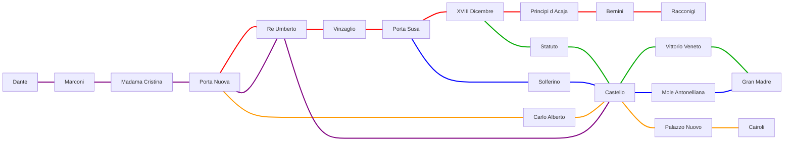

```mermaid
graph LR

%% M1
PN["Porta Nuova"] --- RU["Re Umberto"]
RU --- VZ["Vinzaglio"]
VZ --- PS["Porta Susa"]
PS --- XVIII["XVIII Dicembre"]
XVIII --- PDA["Principi d Acaja"]
PDA --- BE["Bernini"]
BE --- RA["Racconigi"]

%% Linea 4
XVIII --- ST["Statuto"]
ST --- CA["Castello"]
CA --- VV["Vittorio Veneto"]
VV --- GM["Gran Madre"]

%% Linea 13
PS --- SO["Solferino"]
SO --- CA
CA --- MA["Mole Antonelliana"]
MA --- GM

%% Linea 15
PN --- CAR["Carlo Alberto"]
CAR --- CA
CA --- PNV["Palazzo Nuovo"]
PNV --- CI["Cairoli"]

%% Linea 18
DA["Dante"] --- MAR["Marconi"]
MAR --- MC["Madama Cristina"]
MC --- PN
PN --- RU
RU --- CA

%% Colori per linee
linkStyle 0,1,2,3,4,5,6 stroke:#ff0000,stroke-width:3px
linkStyle 7,8,9,10 stroke:#00aa00,stroke-width:3px
linkStyle 11,12,13,14 stroke:#0000ff,stroke-width:3px
linkStyle 15,16,17,18 stroke:#ff9900,stroke-width:3px
linkStyle 19,20,21,22,23 stroke:#800080,stroke-width:3px

```